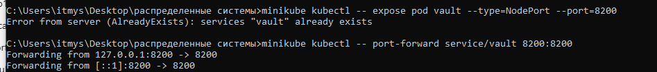
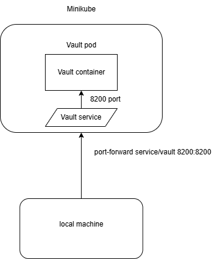

## Общая информация
University: [ITMO University](https://itmo.ru/ru/)

Faculty: [FICT](https://fict.itmo.ru)

Course: [Introduction to distributed technologies](https://github.com/itmo-ict-faculty/introduction-to-distributed-technologies)

Year: 2024/2025

Group: K4110c

Author: Koriakov Sergei Alexeevich

Lab: Lab1

Date of create: 05.11.2024

Date of finished: 05.12.2023


## Ход работы

### 1. Установка Docker

**Определение:**  Docker — это платформа для разработки, развертывания и
запуска приложений в контейнерах. Контейнеры представляют собой
изолированные среды, включающие приложение и все его зависимости.

Docker был заранее установлен в системе

### 2. Установка Minikube

**Определение:**  Minikube — инструмент для запуска локального кластера Kubernetes. 

Kubernetes (K8S) — это система для
автоматизации развертывания, масштабирования и управления
контейнеризированными приложениями.

После установки был запущен minikube


---

### 3. Создание контейнера Vault

**Задание:**  Создать контейнер на основе образа Vault.

1. Скачиваем образ Vault с помощью команды:

```bash
docker pull hashicorp/vault
```

2. Проверяем наличие образа:

получается следующая картина
```bash
docker images
```


3. Создаем контейнер:

```bash
docker run -d --name vault hashicorp/vault
```

4. Проверяем наличие контейнера:

```bash
docker ps -a
```


**Определение:**  Vault — инструмент от HashiCorp для управления секретами и чувствительной информацией.

---

### 4. Создание Pod

**Задание:**  Развернуть Pod в Minikube.

1. Запускаем Minikube:

```bash
minikube start
```

2. Проверяем, что узел запущен:

```bash
kubectl get nodes
```

**Определение:**  Pod — минимальная сущность в Kubernetes, представляющая собой одну или несколько контейнеров,
работающих в одной логической среде.

1. Создаем **YAML-манифест**  для Pod:

```yaml
apiVersion: v1
kind: Pod
metadata:
  name: vault
  labels:
    environment: dev
    tier: vault
spec:
  containers:
    - name: vault
      image: vault
      ports:
        - containerPort: 8200
```

2. Выполняем команду для создания Pod:

```bash
kubectl create -f vault_pod.yaml
```

3. Проверяем наличие Pod:

```bash
kubectl get pods
```


---

### 5. Создание сервиса

**Задание:**  Организовать доступ к Pod через сервис.

1. Создаем сервис:

```bash
minikube kubectl -- expose pod vault --type=NodePort --port=8200
```

2. Перенаправляем трафик на локальный порт:

```bash
minikube kubectl -- port-forward service/vault 8200:8200
```

*сервис уже заранее существовал это вторая попытка*


3. Проверяем работу Vault, открыв страницу авторизации:
   `http://localhost:8200`.

---

### 6. Поиск токена для авторизации

**Задание:**  Найти Root Token для входа в Vault.

1. Вводим команду в терминале:

```bash
minikube kubectl -- logs service/vault
```


2. Копируем и используем Root Token для авторизации.


---

### 7. Создание диаграммы

**Задание:**  Нарисовать схему взаимодействия контейнера, Pod и сервиса.


  

#### Итоговое взаимодействие: 
 
- **Контейнер**  обеспечивает выполнение приложения (`Vault`).
 
- **Pod**  управляет жизненным циклом контейнера и предоставляет внутренний доступ к нему.
 
- **Сервис**  предоставляет стабильную точку подключения к Pod и связывает его с внешним миром.
 
- Команда `port-forward` позволяет локальной машине напрямую взаимодействовать с сервисом в Minikube.
---