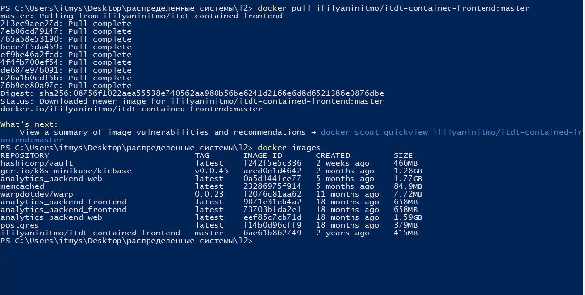
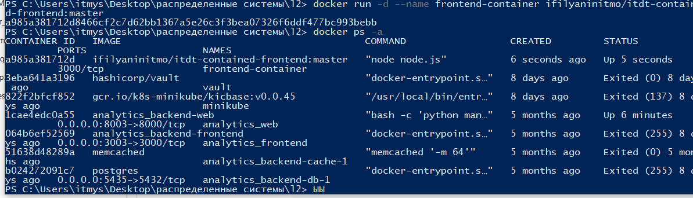
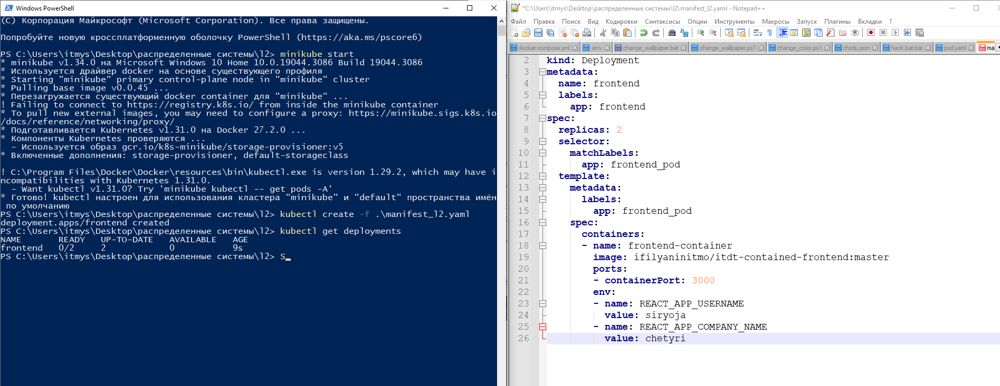
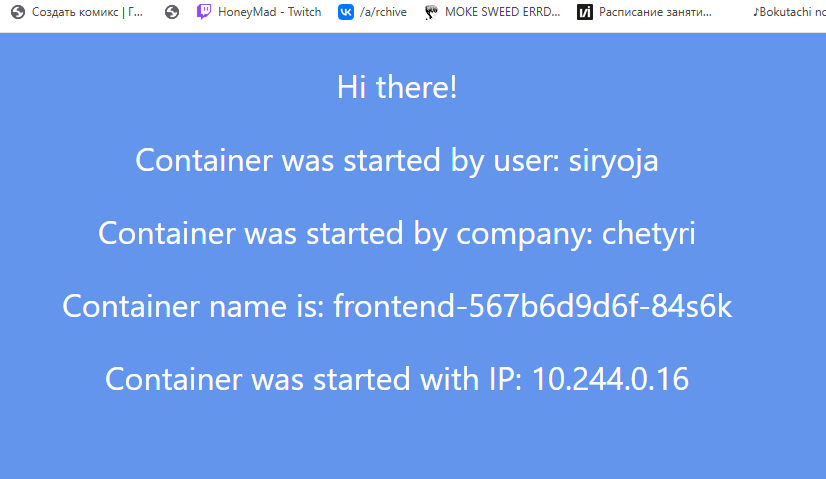
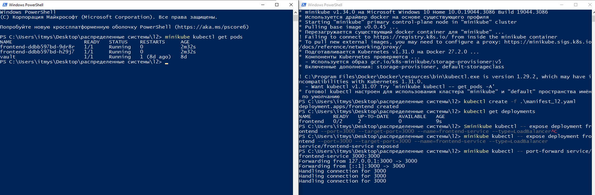
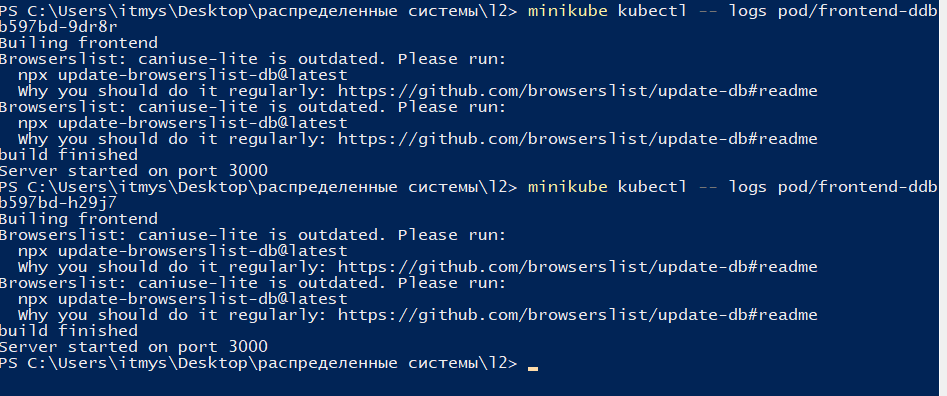
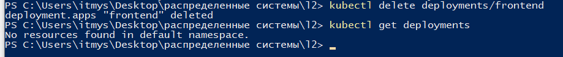
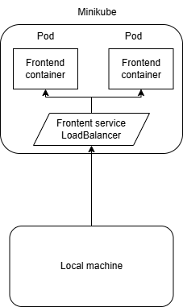

## Общая информация

University: [ITMO University](https://itmo.ru/ru/)

Faculty: [FICT](https://fict.itmo.ru)

Course: [Introduction to distributed technologies](https://github.com/itmo-ict-faculty/introduction-to-distributed-technologies)

Year: 2024/2025

Group: K4110c

Author: Koriakov Sergei Alexeevich

Lab: Lab2

Date of create: 14.11.2024

Date of finished: 05.12.2023

**Теоретическая справка** 

**Deployment**  — это объект Kubernetes, предназначенный для автоматизации
управления развертыванием приложений. Основные возможности:

- **Поддержание работоспособности:**  Kubernetes автоматически восстанавливает удаленные или неработающие поды.

- **Непрерывное обновление:**  Deployment позволяет выполнять обновления приложения без простоев.

- **Откат:**  Возможность вернуться к предыдущей версии приложения при ошибках.

---

**Ход выполнения работы** **1. Создание контейнера**

1. **Скачивание образа контейнера.**
   Выполняем команду:

```bash
docker pull ifilyaninitmo/itdt-contained-frontend:master
```

Скачанный образ можно проверить с помощью команды:

```bash
docker images
```



2. **Создание контейнера.**
   Запускаем контейнер:

```bash
docker run -d --name frontend-container ifilyaninitmo/itdt-contained-frontend:master
```

Проверяем, что контейнер успешно создан:

```bash
docker ps -a
```



---

**2. Развертывание приложения в Minikube**

1. **Запуск Minikube.**
   Перед началом работы запускаем Minikube:

```bash
minikube start
```

Это переключает текущий контекст Kubernetes на Minikube.

2. **Создание Deployment.**
   Создаем манифест `manifest_l2.yaml` для развертывания приложения с двумя репликами. Пример содержимого:

```yaml
apiVersion: apps/v1
kind: Deployment
metadata:
  name: frontend
  labels:
    app: frontend
spec:
  replicas: 2
  selector:
    matchLabels:
      app: frontend_pod
  template:
    metadata:
      labels:
        app: frontend_pod
    spec:
      containers:
        - name: frontend-container
          image: ifilyaninitmo/itdt-contained-frontend:master
          ports:
            - containerPort: 3000
          env:
            - name: REACT_APP_USERNAME
              value: siryoja
            - name: REACT_APP_COMPANY_NAME
              value: chetyri
```

Запускаем развертывание с помощью команды:

```bash
kubectl create -f manifest_l2.yaml
```

Проверяем статус развертывания:

```bash
kubectl get deployments
```




---

**3. Настройка доступа через сервис**

1. **Создание LoadBalancer сервиса.**
   Для обеспечения доступа создаем сервис:

```bash
minikube kubectl -- expose deployment frontend --port=3000 --target-port=3000 --name=frontend-service --type=LoadBalancer
```

Тип `LoadBalancer` обеспечивает балансировку нагрузки между несколькими подами.

2. **Проброс порта.**
   Пробрасываем локальный порт на порт сервиса:

```bash
minikube kubectl -- port-forward service/frontend-service 3000:3000
```

После этого приложение будет доступно по адресу:

```arduino
http://localhost:3000
```





---

**4. Мониторинг системы**

1. **Список подов.**
   Проверяем, что два пода успешно созданы:

```bash
minikube kubectl get pods
```

2. **Логи подов.**
   Получаем логи первого пода:

```bash
minikube kubectl -- logs pod/frontend-<id1>
```

Логи второго пода:

```bash
minikube kubectl -- logs pod/frontend-<id2>
```



---

**5. Завершение работы**
Удаляем развертывание:

```bash
kubectl delete deployments/frontend
```

Останавливаем Minikube:

```bash
minikube stop
```


---

### Итоговая схема


### Итоги лабораторной работы

1. **Образ контейнера:**  был создан образ контейнера веб-приложения с помощью команды `docker pull` и создан контейнер
   с `docker run`. Образ контейнера — это шаблон для запуска изолированных приложений.

2. **Под:**  организован запуск приложения в виде нескольких подов через Deployment. Под — минимальная единица
   вычислений в Kubernetes, содержащая контейнеры и их настройки.

3. **Deployment:**  создан Deployment для автоматизации развертывания двух реплик подов, их поддержания и обновления без
   простоя. Deployment — ресурс Kubernetes, управляющий жизненным циклом приложений.

4. **LoadBalancer:**  настроен сервис типа LoadBalancer для объединения подов и предоставления единой точки доступа.
   Сервис — это объект Kubernetes, который определяет, как клиентам подключаться к подам.

5. **Port-forward:**  осуществлен проброс порта с кластера на локальную машину для доступа к приложению через
   веб-браузер.

6. **Мониторинг:**  проверено состояние подов с помощью команд `kubectl get pods` и просмотрел их логи.

7. **Удаление ресурсов:**  удалены Deployment и завершена работу с кластером Minikube, чтобы освободить ресурсы.

---
