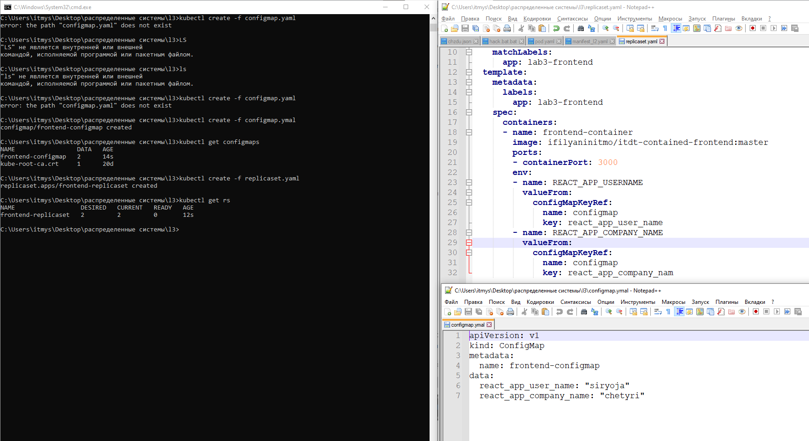
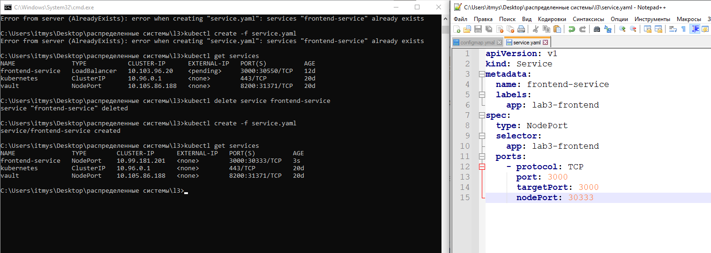
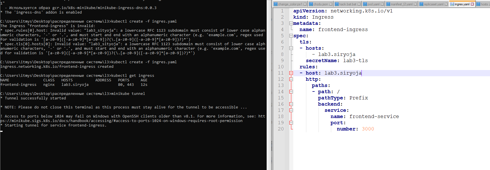
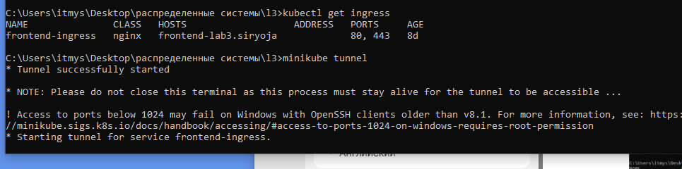
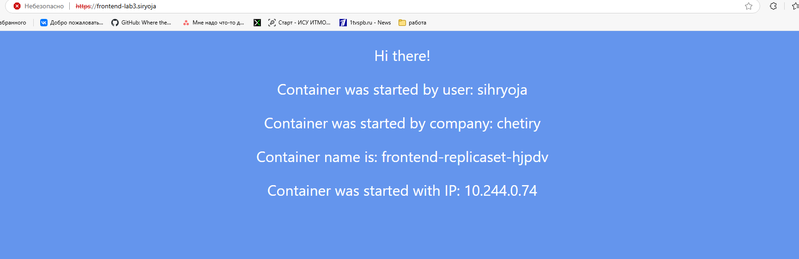
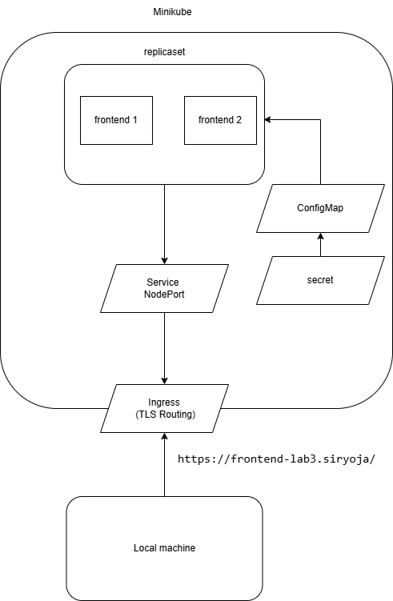

## Общая информация

University: [ITMO University](https://itmo.ru/ru/)

Faculty: [FICT](https://fict.itmo.ru)

Course: [Introduction to distributed technologies](https://github.com/itmo-ict-faculty/introduction-to-distributed-technologies)

Year: 2024/2025

Group: K4110c

Author: Koriakov Sergei Alexeevich

Lab: Lab3

Date of create: 26.11.2024

Date of finished: 05.12.2023

## **Теоретическая справка**

### ConfigMaps

[ConfigMap](https://kubernetes.io/docs/concepts/configuration/configmap/)  — это объект в Kubernetes, предназначенный
для хранения **неконфиденциальных**  данных в виде пар ключ-значение.
ConfigMaps помогают разделять данные конфигурации и код приложения, при этом объем данных не должен превышать 1 Мб.

### Secrets

[Secret](https://kubernetes.io/docs/concepts/configuration/secret/)  — объект Kubernetes для хранения конфиденциальных
данных, таких как пароли, токены или ключи. Эти данные кодируются в формате base64.
Secret аналогичен ConfigMap, но используется для хранения конфиденциальной информации.

### ReplicaSets

[ReplicaSet](https://kubernetes.io/docs/concepts/workloads/controllers/replicaset/)  — это ресурс Kubernetes, который
гарантирует наличие определенного количества реплик подов в любой момент времени.

### TLS

SSL расшифровывается как Secure Sockets Layer, а TLS (Transport Layer Security) — это более современная версия
протокола, обеспечивающая безопасность передачи данных между клиентом и сервером. Сертификат TLS используется для
шифрования данных и для проверки подлинности веб-сайта.

> Сертификат включает публичный ключ для шифрования, а приватный ключ — для расшифровки.

### Ingress

[Ingress](https://kubernetes.io/docs/concepts/services-networking/ingress/)  — это объект Kubernetes, который определяет
единую точку входа в кластер и позволяет назначить каждому сервису уникальный URL для доступа извне.

---

## Ход работы и мои замечания

### Создание ConfigMap

Запускаем Minikube с помощью команды `minikube start`. Если не использовать Minikube, контекст может быть задан
неправильно (например, для `docker-desktop`), и развертывание будет недоступно .Пример манифеста для ConfigMap можно
найти в [официальной документации](https://kubernetes.io/docs/concepts/configuration/configmap/):

```yaml
apiVersion: v1
kind: ConfigMap
metadata:
  name: frontend-configmap
data:
  react_app_user_name: "sihryoja"
  react_app_company_name: "chetiry"
```

Здесь мы сохраняем значения для переменных `REACT_APP_USERNAME` и `REACT_APP_COMPANY_NAME`.Чтобы создать ConfigMap,
используем команду: `kubectl create -f frontend-configmap.yaml`. Проверяем, что ConfigMap был
создан: `kubectl get configmaps`

### Создание ReplicaSet

Пример манифеста для ReplicaSet можно найти
в [официальной документации](https://kubernetes.io/docs/concepts/workloads/controllers/replicaset/):

```yaml
apiVersion: apps/v1
kind: ReplicaSet
metadata:
  name: frontend-replicaset
  labels:
    app: lab3-frontend
spec:
  replicas: 2
  selector:
    matchLabels:
      app: lab3-frontend
  template:
    metadata:
      labels:
        app: lab3-frontend
    spec:
      containers:
        - name: frontend-container
          image: ifilyaninitmo/itdt-contained-frontend:master
          ports:
            - containerPort: 3000
          env:
            - name: REACT_APP_USERNAME
              valueFrom:
                configMapKeyRef:
                  name: frontend-configmap
                  key: react_app_user_name
            - name: REACT_APP_COMPANY_NAME
              valueFrom:
                configMapKeyRef:
                  name: frontend-configmap
                  key: react_app_company_name
```

Создаем ReplicaSet с помощью команды:

`kubectl create -f frontend-replicaset-manifest.yaml`

Проверяем создание
ReplicaSet: `kubectl get rs`



### Создание сервиса

Для создания ресурса Ingress потребуется сервис. Пример манифеста для сервиса:

```yaml
apiVersion: v1
kind: Service
metadata:
  name: frontend-service
  labels:
    app: lab3-frontend
spec:
  type: NodePort
  selector:
    app: lab3-frontend
  ports:
    - protocol: TCP
      port: 3000
      targetPort: 3000
      nodePort: 30333
```

Порты для NodePort находятся в диапазоне 30000–32767. Создаем сервис с
командой:

`kubectl create -f frontend-service.yaml`

Проверяем создание сервиса: `kubectl get services`



### Генерация TLS

Для создания TLS сертификата используем OpenSSL. Сначала генерируем приватный ключ:

```csharp
openssl genrsa -out lab3.key 2048
```

Затем создаем запрос на подпись для сертификата:

```vbnet
openssl req -key lab3.key -new -out lab3.csr
```

После этого подписываем сертификат:

```csharp
openssl x509 -signkey lab3.key -in lab3.csr -req -days 30 -out lab3.crt
```



### Создание Secret

Для создания секретного ресурса используем команду:

```
kubectl create secret tls lab3-tls --cert=lab3.crt --key=lab3.keyy
```

### Создание Ingress

Активируем Ingress в Minikube:

```bash
minikube addons enable ingress
minikube addons enable ingress-dns
```

Манифест для Ingress:

```yaml
apiVersion: networking.k8s.io/v1
kind: Ingress
metadata:
  name: frontend-ingress
spec:
  tls:
    - hosts:
        - frontend-lab3.siryoja
      secretName: lab3-tls
  rules:
    - host: frontend-lab3.siryoja
      http:
        paths:
          - path: /
            pathType: Prefix
            backend:
              service:
                name: frontend-service
                port:
                  number: 3000
```

Был создан хост с неверным именем из-за этого пришлось пересоздавать секретные ключи и ингресс.

Были изменены названия файлов

Создаем точку входа в кластер с помощью команды:

`kubectl create -f frontend-ingress.yaml`

Проверяем создание Ingress: `kubectl get ingress`

Запускаем туннель для Ingress: `minikube tunnel`

Открываем страницу: `https://frontend-lab3.siryoja`



### Схема архитектуры


---

### Заключение

В данной лабораторной работе был создан и настроен локальный кластер Kubernetes с использованием Minikube. Основное
внимание уделялось созданию и использованию **ConfigMap**, **Secrets**, **ReplicaSets**, **Services**, и **Ingress**
для безопасного хранения данных и организации безопасного доступа к приложениям в Kubernetes.

1. **ConfigMap**  был использован для хранения неконфиденциальных данных, таких как переменные окружения для приложения.

2. **ReplicaSet**  обеспечивал создание и поддержание заданного количества реплик подов, на которых запускалось
   приложение.

3. **Service**  типа **NodePort**  был настроен для предоставления доступа к приложению на определённом порту.

4. **Ingress**  был настроен для управления внешним доступом и использования **TLS-сертификатов**  для защиты трафика
   между пользователем и сервисом.
   В процессе работы были созданы сертификаты с помощью OpenSSL, с использованием которых был настроен безопасный доступ
   через **Ingress**.

### Определения понятий

- **ConfigMap**  — объект Kubernetes для хранения неконфиденциальных данных в виде пар "ключ-значение", которые могут
  быть использованы в контейнерах приложения.

- **Secrets**  — объект Kubernetes для безопасного хранения конфиденциальных данных (например, паролей или ключей),
  данные в **Secrets**  кодируются в формате base64.

- **ReplicaSet**  — контроллер в Kubernetes, который гарантирует, что определённое количество реплик подов всегда будет
  работать.

- **NodePort**  —  предосталвяет доступ к подам из внешнего мира через определённый
  порт.
 
- **Ingress**  — объект, который управляет внешним доступом к сервисам Kubernetes, позволяя маршрутизировать HTTP(S)
  трафик к нужным сервисам внутри кластера. Поддерживает использование **TLS**  для защиты соединений.

- **TLS (Transport Layer Security)**  — протокол шифрования, который используется для защиты данных, передаваемых по
  сети, и для аутентификации сервера. В Kubernetes **Ingress**  может быть настроен для работы с TLS-сертификатами.