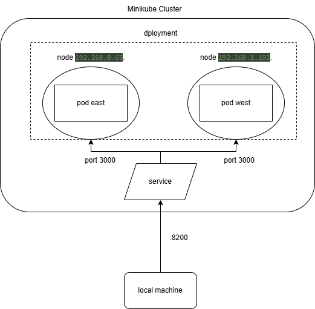

## Общая информация

University: [ITMO University](https://itmo.ru/ru/)

Faculty: [FICT](https://fict.itmo.ru)

Course: [Introduction to distributed technologies](https://github.com/itmo-ict-faculty/introduction-to-distributed-technologies)

Year: 2024/2025

Group: K4110c

Author: Koriakov Sergei Alexeevich

Lab: Lab4

Date of create: 30.11.2024

Date of finished: 11.12.2023

## Теоретическая справка

### Network Policy

[NetworkPolicy (сетевая политика)](https://kubernetes.io/docs/concepts/services-networking/network-policies/) — это
ресурс Kubernetes, предназначенный для управления сетевым трафиком, который проходит через кластер.

В Kubernetes используются одновременно **underlay** и **overlay** сети. Согласно документации:

> Kubernetes NetworkPolicies позволяют управлять сетевым трафиком Pod'ов на уровне IP-адресов или портов (уровни 3 и 4
> модели OSI).

- **Underlay сеть** — это физическая IP-сеть с постоянной конфигурацией, которая служит основой для overlay сети.
- **Overlay сеть** — виртуальная сеть туннелей, работающая поверх underlay, обеспечивающая изоляцию клиентов и связь
  между их виртуальными машинами.

### CNI

**Интерфейс контейнерной сети (CNI)** — это спецификация, позволяющая создать унифицированное сетевое решение для
Linux-контейнеров.

Основные элементы CNI:

- **CNI plugin** — исполняемый файл, отвечающий за настройку сети Pod'ов.
- **Сетевой провайдер (например, Calico)** — обеспечивает каждому Pod'у уникальный IP и управляет настройками сети через
  свой агент и конфигурации.

CNI, используемый в Minikube по умолчанию, не поддерживает NetworkPolicy, поэтому мы используем **Calico**, который
является более функциональным провайдером.

### IPAM

**IPAM (управление IP-адресами)** — это служба, распределяющая IP-адреса для Pod'ов в кластере. Она помогает
администрировать и отслеживать IP-пространство.

### CoreDNS

**CoreDNS** — это DNS-сервер, используемый в Kubernetes для обнаружения сервисов (Service Discovery). Этот процесс
позволяет приложениям находить друг друга и конфигурации, необходимые для работы.

Service Discovery:

- Обеспечивает автоматическое подключение нового экземпляра приложения к существующему окружению.
- Может хранить конфигурации, сертификаты и другие данные.
- Помогает обнаруживать сбои и отказоустойчиво работать.

---

## Ход работы

### Calico и Multi-Node Clusters

Запустим Minikube с настройками:

```bash
minikube start --network-plugin=cni --cni=calico --nodes 2 -p multinode-demo
```

Проверим запуск двух Node:

```bash
kubectl get nodes
```

Убедимся в работе Pod'ов Calico:

```bash
kubectl get pods -l k8s-app=calico-node -A
```

**Определение:** Под управлением CNI Calico каждый Pod получает уникальный IP-адрес, а взаимодействие между узлами
кластера обеспечивается настройками Calico.

Добавим лейблы к узлам, чтобы распределение IP-адресов соответствовало манифесту IPPool:

```bash
kubectl label nodes <имя-узла> zone=east
kubectl label nodes <имя-узла> zone=west
```

Проверим лейблы на узлах:

```bash
kubectl get nodes --show-labels
```

**Определение:** Лейблы помогают Calico применять сетевые настройки к узлам в соответствии с их зональной
принадлежностью.

### calicoctl и IPPool

Создадим манифест IPPool для назначения IP-адресов узлам:

```yaml
apiVersion: projectcalico.org/v3
kind: IPPool
metadata:
  name: zone-east-ippool
spec:
  cidr: 192.168.0.0/24
  ipipMode: Always
  natOutgoing: true
  nodeSelector: zone == "east"
---
apiVersion: projectcalico.org/v3
kind: IPPool
metadata:
  name: zone-west-ippool
spec:
  cidr: 192.168.1.0/24
  ipipMode: Always
  natOutgoing: true
  nodeSelector: zone == "west"
```

Применим манифест, установив **calicoctl**:

```bash
kubectl create -f calicoctl.yaml
```


Проверим созданные IPPool'ы:

```bash
kubectl exec -i -n kube-system calicoctl -- /usr/bin/calicoctl --allow-version-mismatch get ippools -o wide
```

Удалим IPPool по умолчанию и создадим новые:

```bash
kubectl delete ippools default-ipv4-ippool
kubectl exec -i -n kube-system calicoctl -- /usr/bin/calicoctl --allow-version-mismatch create -f - < lab4-ippool.yaml
```

Проверим пуллы:

```bash
kubectl exec -i -n kube-system calicoctl -- /calicoctl --allow-version-mismatch get ippools -o wide
```

**Определение:** IPPool управляет распределением IP-адресов в зависимости от меток узлов, обеспечивая оптимальное
использование сетевых ресурсов.

### Deployment и Service

Создадим Deployment и Service для приложения. Деплоймент возьмем из второй работы.
Манифесты:

```yaml
apiVersion: v1
kind: Service
metadata:
  name: lab4-service
spec:
  selector:
    app: lab4-frontend
  ports:
    - port: 3000
      targetPort: 3000
  type: LoadBalancer
```

Применим манифесты:

```bash
kubectl apply -f lab4-deployment.yaml -f lab4-service.yaml
```

Проверим созданные ресурсы:

```bash
kubectl get deployments
kubectl get services
```

Проверьте созданные ресурсы:

```bash
kubectl get deployments
kubectl get services
```

Проверим IP созданных Pod'ов
```bash
kubectl get pods -o wide
```


**Определение:** Deployment отвечает за управление состоянием Pod'ов, а Service обеспечивает доступ к приложению.

### Проброс порта

Для проверки сервиса выполним проброс порта:

```bash
kubectl port-forward service/lab4-service 8200:3000
```

Перейдём по адресу `http://localhost:8200/`.


### Проверка пинга между Pod'ами

Выполним проверку связи между Pod'ами через команды:

```bash
kubectl exec -ti lab4-deployment-hash -- sh
ping 192.168.0.65
exit
```

```bash
kubectl exec -ti lab4-deployment-hash -- sh
ping 192.168.1.192
exit
```


### Диаграмма



## Выводы

В ходе выполнение ЛР были выполнены следующие шаги
 
1. **Установка кластера Kubernetes:** 
  - Запущен кластер Minikube с использованием CNI-плагина Calico для поддержки NetworkPolicy и настройки многозадачного окружения.
 
2. **Настройка сетевого взаимодействия:** 
  - Созданы IPPool с указанием диапазонов IP-адресов и привязкой к узлам через лейблы.

  - Удален IPPool по умолчанию и применены новые.
 
3. **Разворачивание приложения:** 
  - Создан и развернут Deployment с приложением.

  - Настроен Service типа LoadBalancer для обеспечения доступа к приложению.
 
4. **Проверка соединения:** 
  - Выполнены пинги между Pod'ами для проверки сетевого взаимодействия.

  - Использован проброс порта для доступа к приложению через веб-браузер.

